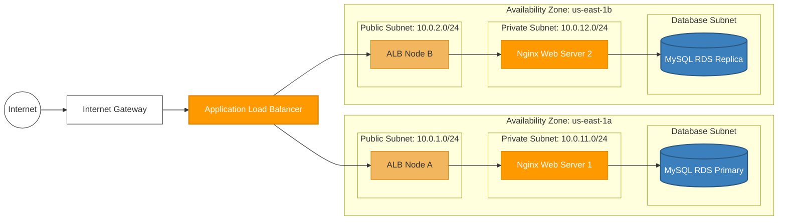

# AWS 3-Tier Core Network Architecture (Automated via Terraform)

This project maps out a resilient, secure three-tier infrastructure on AWS, provisioned entirely as code using HashiCorp Terraform. My primary objective here was absolute network isolation—ensuring that public internet traffic is strictly sandboxed and can never directly communicate with backend compute instances or database storage tiers.

## 📊 Core Architecture Diagram



## 🛠️ The Technical Breakdown & Engineering Decisions

Instead of utilizing default AWS settings or placing resources out in the open, I designed this network following a hardened, multi-layered security blueprint:

### 1. The Public Ingress Tier (The Border Control)
* **Application Load Balancer (ALB)**: Public traffic hits the Internet Gateway (IGW) and is immediately forced into an internet-facing ALB spanning both public subnets for high availability.
* **Edge Security**: The ALB is the only resource exposed to the internet. It handles incoming HTTP port 80 traffic, shielding the internal architecture.

### 2. The Quarantined Compute Tier (The App Logic)
* **Zero Public IPs**: The EC2 instances running Nginx are entirely hidden away inside isolated private subnets. They have no public IP addresses, meaning they cannot be discovered or directly scanned from the outside world.
* **Security Group Chaining**: To prevent internal lateral movement, the EC2 instances use stateful firewalls configured to reject *all* traffic unless it explicitly originates from the security group ID of the Application Load Balancer.

### 3. The Isolated Database Tier (The Data Store)
* **Isolated Subnets**: The MySQL RDS instances live in dedicated database subnets at the very bottom of the stack, completely separated from the web servers.
* **Tightest Privilege Ingress**: The database security group blocks everything except port 3306, and it will only establish a handshake if the inbound request is coming from the Web Server's security group.

### 4. Operational Assets & Visibility
* **S3 State Storage**: An S3 bucket is provisioned alongside the infrastructure to handle system logs and static application assets safely.
* **Proactive Monitoring**: I integrated CloudWatch CPU utilization metrics and metric alarms directly into the Terraform deployment script to alert on sudden compute resource exhaustion.

## ⚙️ CI/CD Linting & Validation Pipeline

To make sure my infrastructure files are safe and correctly formatted before pushing changes anywhere near a production environment, I configured an automated pipeline using **GitHub Actions**. On every push to the repository, a runner executes:
* `terraform fmt -check`: Guarantees the code matches canonical HashiCorp formatting rules.
* `terraform validate`: Statically verifies file syntax and resource relationships before any AWS execution begins.

## 🖥️ Verified Execution Outputs

Because keeping live infrastructure running in a personal environment generates unnecessary AWS costs, I follow a clean development cycle where resources are torn down immediately after verification. Below is the exact, successful local state execution output:

```text
Apply complete! Resources: 14 added, 0 changed, 0 destroyed.

Outputs:
vpc_id         = "vpc-0a1b2c3d4e5f6g7h8"
alb_dns_name   = "aws-3tier-alb-123456789.us-east-1.elb.amazonaws.com"
ec2_private_ip = "10.0.3.45"
rds_endpoint   = "://amazonaws.com"
s3_bucket_name = "aws-3tier-assets-portfolio-bucket"
```

## 🚀 How to Spin It Up Locally

1. Clone this repository to your machine.
2. Authenticate your terminal using the AWS CLI (`aws configure`).
3. Jump into the deployment directory:
```bash
cd infra/
```
4. Run the standard Terraform deployment cycle:
```bash
terraform init
terraform plan
terraform apply
```
