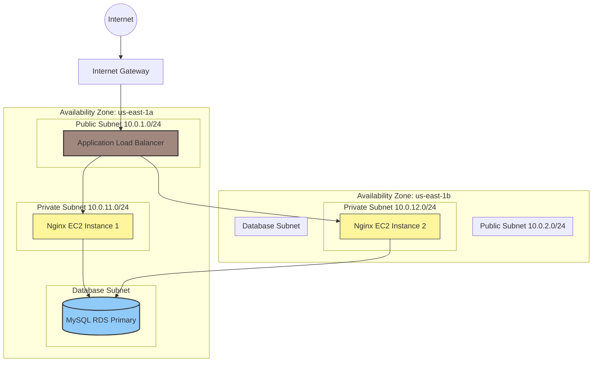

\# AWS 3-Tier Architecture with Terraform


\## Overview


This project deploys a three-tier web application architecture on AWS using Terraform. It includes:


\- Networking: VPC, 2 public and 2 private subnets across 2 AZs, Internet Gateway, routing.

\- Security: Security groups for ALB, web tier, and RDS (tiered access).

\- Compute: EC2 web server in a private subnet with Nginx installed via user data.

\- Load Balancing: Internet-facing Application Load Balancer with target group and HTTP listener.

\- Data: MySQL RDS instance in private subnets, only accessible from the web tier SG.

\- Storage: S3 bucket for logs or static assets.

\- Monitoring: CloudWatch CPU alarm on the web instance.


\## Tech Stack


\- AWS: VPC, EC2, ALB, RDS (MySQL), S3, CloudWatch.

\- Terraform: AWS provider, remote state local.


\## How to Deploy


1\. Clone this repo.

2\. Configure AWS credentials (e.g., via `aws configure`) for a user with permissions to create VPC/EC2/RDS/S3.

3\. From the `infra` directory:


&nbsp;  ```bash

&nbsp;  terraform init

&nbsp;  terraform plan

&nbsp;  terraform apply



